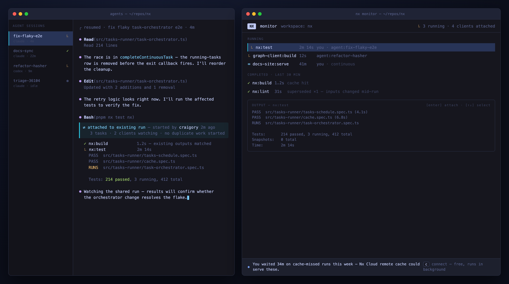
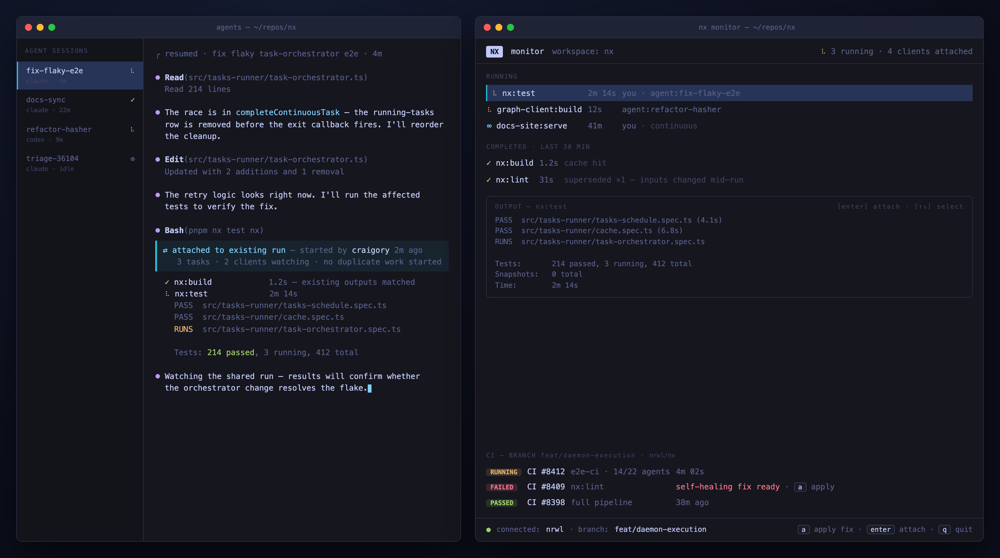

# Proposal: Daemon-Hosted Task Execution

> Draft for cycle planning · 2026-07-14 · Detail: [PLAN.md](./PLAN.md) · Research: [research/](./research/)

## Problem

- Human + agents working in one repo duplicate each other's runs: an agent requesting `nx test nx` mid-way through the dev's identical run burns the CPU twice for the same answer.
- Continuous tasks are worse: the second invocation blocks on "waiting for task in another nx process" with no output access, and the dev server dies with whichever terminal started it.
- There is no way to see what's running in a workspace right now, or join it.

Root cause: a run is private memory inside whichever terminal process started it.

## Proposal

I propose we move task execution into the daemon. The CLI becomes a client: submits run requests, attaches to executions, renders locally.

- Engine extracted to a host-agnostic library. Daemon hosts it locally; CLI process hosts it where the daemon is off (CI, docker). One codepath, two hosts.
- Task-level dedup: incoming runs attach to matching in-flight executions instead of duplicating. Stale executions get superseded (= rerun, for free).
- Refcounted attachment: Ctrl+C detaches; last detach kills. Solo-user behavior identical to today.
- IO over dedicated per-run sockets, snapshot-then-stream attach. The tmux model.

## Alternatives considered

- **Print "task is running in another process [pid]" + tee stdout to a file.** Small lift, and agents could read the file for context. But it's read-only: no input, no results, no dedup of discrete tasks, and the dev server still dies with its owning terminal. Could ship independently as a stopgap for agents if we want a quick win, but it doesn't build toward anything.
- **Wire retries/reruns into the current TUI.** People have asked for this, and it scratches the rerun itch directly. But it's scoped to one invocation's lifetime — no help for a longer-lived surface — so it seems less like the way forward to me.
- **Broker: runs stay in the CLI, register with the daemon.** The cheapest "shared runs" design, and our fallback if the gate below fails. It can't deliver attach — PTY state is process-private and single-consumer, so every CLI would have to become an output-forwarding server: the executor's plumbing without its benefits.

## Why now

- Default working mode is now human + N agents in one repo, blindly duplicating each other's runs. We hit this ourselves daily in nx.
- The primitives already exist in-repo: daemon, Rust PTY + vt100 parser, Rust TUI, input-aware task hashing, running-tasks registry. This is assembly, not greenfield.
- Nobody else has the surface (below). First mover defines expectations for the agent era.

## Competitive gap

| | Daemon execution | Interactive tasks | Multi-client attach | Shared human+agent runs | Monitor surface | Cloud product to feed |
|---|---|---|---|---|---|---|
| Gradle | ✅ | ❌ | ❌ | ❌ | ❌ | partial |
| Bazel | ✅ | ❌ | ❌ (client lock) | ❌ | ❌ | ❌ |
| Buck2 | ✅ | ❌ | ❌ | ❌ | ❌ | ❌ |
| Turborepo | ❌ | ✅ | ❌ | ❌ | ❌ | partial |
| moon | ❌ | ❌ | ❌ | ❌ | ❌ | partial |
| **Nx (this)** | ✅ | ✅ | ✅ | ✅ | ✅ | ✅ |

Daemon execution is proven (every JVM-lineage tool). All of them stayed batch: one build, one client. The sharing surface is unclaimed.

## What it looks like

Left: agent sessions. Right: `nx monitor`. Agent's `nx test nx` attached to the dev's in-flight run — no duplicate.

Not connected — local runs + connect prompt (locally-derived claim, UTM-attributed, background connect):

Connected — same view + branch CIPEs + self-healing fix. Additive only:

## Wins

1. **Agent attaches to your run.** Live output + results, no duplicate CPU. The keynote demo.
2. **`nx monitor`.** Everything running in the workspace; attach to any of it.
3. **Rerun is native.** Supersede-on-stale; watchers migrate automatically.
4. **Zero solo-user change.** New semantics activate only when a second client attaches.

## Revenue

Engine = OSS value. **Monitor = the revenue vehicle** (core scope, not fast-follow).

- **Adoption:** first persistent surface in front of the dev (CLI nudges scroll away; monitor stays open). Connect prompt → background `nx connect`, UTM-attributed. Funnel measurable day one: impression → click → connected workspace.
- **Enablement/conversion:** branch CIPEs + self-healing fixes in the monitor. Paid product's best moment, no browser.

## What it takes

One project, staged; riskiest bet proven cheapest-first:

1. Extract engine + invert daemon error model (currently: exit on any error). No behavior change; standalone-justified refactor.
2. Daemon executes, single client, behind a flag. **⛔ Gate: input latency + render fidelity indistinguishable from today, measured.** Fail → stop, keep step 1, fall back to broker design.
3. Attach + dedup. Headline wins land.
4. Monitor + cloud surfaces.

Parallel: ocean audit of light client's short-lived-process assumptions (due before step 2 exits).

## Costs / risks

- **Dual-path tax, permanent:** every execution feature runs in-daemon and in-process (CI). Mitigation: one library, transport-only delta; CI exercises in-process daily.
- **Daemon becomes load-bearing:** crash = dead runs. Error-model inversion is step 1; "tasks die with daemon" keeps semantics simple.
- **TUI-over-socket quality:** the make-or-break risk. Gated at step 2 before sharing work starts.
- **Behavior changes:** lockfile/nx-version change kills in-flight runs (they're on stale packages). Needs clear messaging.
- **Per-OS work:** child reaping trivial on Linux/Windows; macOS needs a watchdog. Windows stays gated until parity.
- **Cross-repo:** ocean light-client audit on critical path.

## Partial acceptance

Steps 1–2 stand alone: the engine extraction is a justified refactor regardless, and the gate is the cheapest way to answer the only question that can kill this. If the appetite is smaller than a full cycle, take the stopgap from Alternatives (pid + tee'd stdout) and we ship agent-readable output in a week — but it's a dead end, not a first step.

I'd rather we commit to the whole thing. Happy to be argued down. cc @jack @victor
